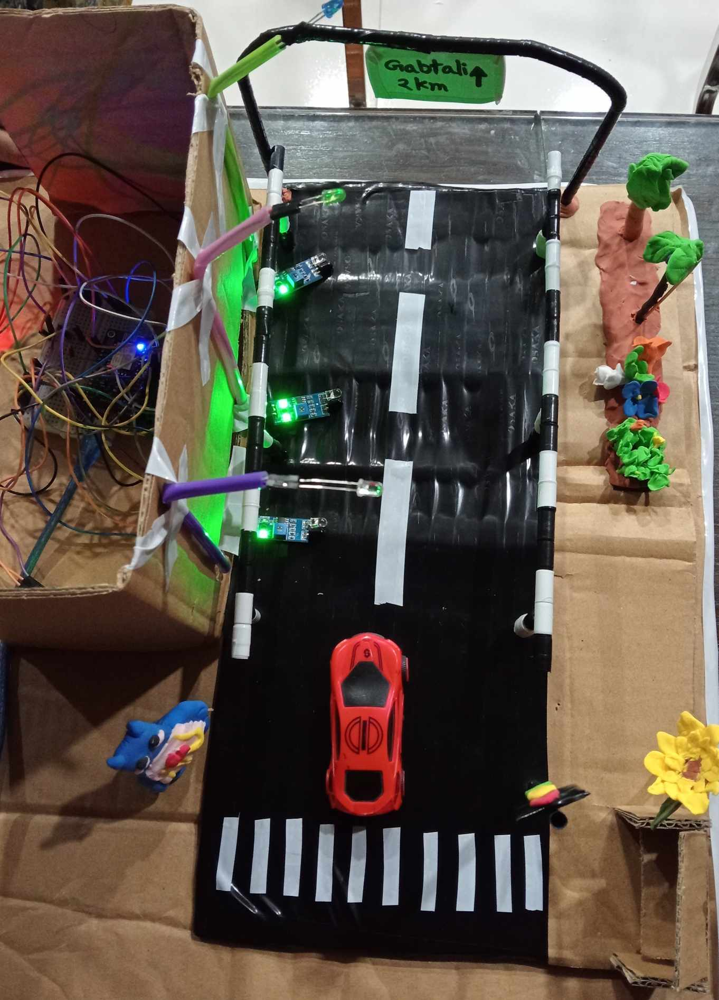

## 📖 Project Overview
The **Smart Street Lighting System** is an IoT-based solution designed to optimize street lighting in urban areas. The system intelligently controls street lights based on environmental conditions, vehicle and pedestrian movement, and energy consumption data, ensuring energy efficiency and safety.

---

## ⚡ Features
- **Automatic Light Control**: Lights turn on/off based on ambient light conditions.
- **Motion Detection**: Street lights brighten when vehicles or pedestrians are nearby.
- **Energy Efficiency**: Reduces unnecessary power consumption.
- **Remote Monitoring**: Real-time monitoring of street lights through IoT-enabled devices.
- **Fault Detection**: Alerts when a street light fails or requires maintenance.

---

## 🛠️ Technologies Used
- **IoT Devices**: Sensors (light, motion), microcontrollers (Arduino/Raspberry Pi)
- **Communication Protocols**: Wi-Fi, MQTT
- **Programming Languages**: C/C++ (Arduino), Python
- **Visual Dashboard**: Mobile or web dashboard for visualization and control(Blynk App)

---

## 🔧 System Architecture
1. **Sensors** detect light levels and motion.
2. **Microcontroller** processes the sensor data.
3. **Decision Module** determines whether to turn lights on/off or adjust brightness.
4. **Actuators (LED street lights)** respond based on commands.
5. **Data Transmission** sends sensor and status information to the cloud dashboard for monitoring.

---

## 🖼️ Diagrams
- **System Overview**  
  

- **Top View Architecture**  
  

---

